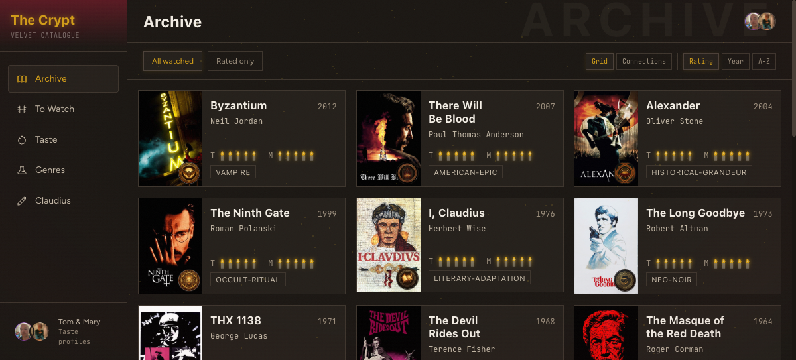
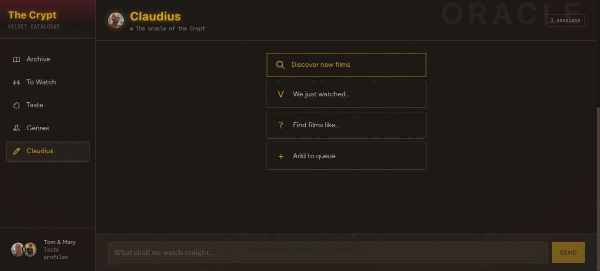
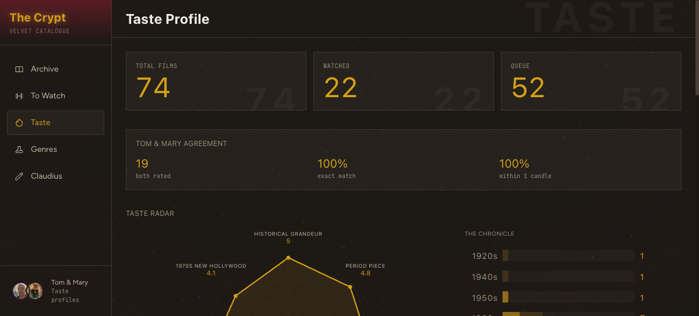

# CRYPT LIBRARIAN — VELVET CATALOGUE

Film curation archive for pre-2016 cinema with literary/gothic sensibility, occult atmosphere, and historical grandeur. Autonomous discovery agent, multi-voice commentary, and a Three.js-atmospheric web interface where an ensouled oracle recommends films by candlelight. Built with [claude-code-minoan](https://github.com/tdimino/claude-code-minoan) skills.







## Run it

```bash
# Quick look (static mode — no oracle chat)
cd repo/web/frontend/out && python3 -m http.server 4200
# → http://localhost:4200

# Full stack (requires Python 3.11+, Node 18+, uv)
cd repo/web/frontend && npm install && npm run build
cd repo/web && uv run python3 server.py
# → http://localhost:4200 (full mode with Claudius oracle)

# Fetch movie posters (requires TMDB API key)
TMDB_API_KEY=xxx uv run --with requests repo/web/frontend/public/posters/fetch_posters.py
```

Also deployed to Cloudflare Pages at `buttia-cinema.pages.dev` (basic auth, password: "hoodrats").

## Design

Conceptual direction: **candlelit rare-book room**. Leather, foxed parchment, amber lamplight, wine-dark velvet. Every surface is named for a physical layer of a bound book — `--binding` (deepest), `--endpaper`, `--page`, `--crease`, `--spine`.

| Dial | Value | Meaning |
|------|-------|---------|
| VARIANCE | 6 | Editorial asymmetry, not dashboard |
| MOTION | 4 | Subtle hover warmth, staggered load |
| DENSITY | 5 | Comfortable reading, not cockpit |

Ratings use candle flames (SVG), not stars. 1-5 scale with graduated amber tones. Consistent with the `watchlist.md` convention of "5 candles."

## Stack

| Layer | Technology |
|-------|-----------|
| Backend | FastAPI (Python) — `web/server.py` |
| Frontend | Next.js 16 static export |
| Styling | Tailwind v4 + CSS custom properties |
| Animation | Framer Motion |
| 3D/Atmosphere | React Three Fiber + custom GLSL shaders |
| Chat | `claude -p` subprocess via SSE streaming |
| Sessions | SQLite |
| Agent | Claude Agent SDK (5 subagents) |

## Pages

| Route | Tab | Content |
|-------|-----|---------|
| `/` | Archive | Watched films grid with poster thumbnails, tilt-card hover, sort by rating/year/A-Z |
| `/queue` | To Watch | The Screening Programme — single card (poster + text, prev/next, keyboard arrows) or columns view, grouping by source/genre/all |
| `/taste` | Taste | Lane calibration, SVG radar chart + decade timeline side-by-side, Tom/Mary comparison |
| `/genres` | Genres | The Bestiary — 16 genre medallion gallery |
| `/claudius` | Claudius | Oracle chat with Oracle Smoke particle background, dev mode (Ctrl+Shift+D), connection status indicator |

Film detail: 780px side panel (desktop) / bottom sheet (mobile). Two columns — 300px poster with museum-placard caption + 480px scrollable detail. Close button pinned in non-scrolling header.

## Controls

| Key | Action |
|-----|--------|
| `Ctrl+Shift+D` | Toggle dev panel (SSE event log, connection status, active tools) |
| `←` / `→` | Navigate films in queue single-card mode |

## Assets

| Asset | Directory | Count | Source |
|-------|-----------|-------|--------|
| Movie posters | `public/posters/` | 49 JPG + 49 SVG fallback | TMDB API (`fetch_posters.py`) |
| Genre badges | `public/badges/` | 16 PNG | Nano Banana Pro (`generate_badges.py`) |
| Avatars | `public/avatars/` | 2 real + 2 Baroque portraits + 1 daimon | Chrome CDP + Nano Banana Pro |

Poster JPGs and badge PNGs are fetched/generated via scripts — not checked into this repo.

## Documentation

| File | Contents |
|------|----------|
| [ARCHITECTURE.md](ARCHITECTURE.md) | System architecture, component map, data flow, extension points |
| [docs/design-system.md](docs/design-system.md) | Color tokens, typography, spatial composition, candle ratings |
| [docs/three-js-components.md](docs/three-js-components.md) | ProjectorDust, OracleSmoke, TiltCard, TasteRadar3D — shaders, physics, GPU |
| [docs/claude-integration.md](docs/claude-integration.md) | SSE streaming, connection state machine, dev mode, ensouled mode |
| [docs/agent-architecture.md](docs/agent-architecture.md) | 5-subagent pipeline, taste calibration loop, provenance tracking |

## Autonomous Agent

Weekly discovery agent using Claude Agent SDK with 5 subagents (taste learner, film discoverer, content validator, database manager, subtitle hunter). Taste compounds over time — approved films become seeds for future discovery.

```bash
python3 repo/agent/crypt_librarian.py    # Run discovery
python3 repo/agent/approve.py            # Review candidates
```

## Skills Used

This project was built using the following claude-code-minoan skills:

| Skill | Purpose |
|-------|---------|
| `minoan-frontend-design` | Creative direction, design tokens, component design |
| `threejs-particle-canvas` | OracleSmoke particle system (Mode 1 adaptation) |
| `design-polish` | Final pass on spacing, transitions, interaction states |
| `design-critique` | Nielsen heuristics review, cognitive load assessment |
| `exa-search` | Film discovery via neural web search |
| `firecrawl` | Letterboxd, Criterion, MUBI list scraping |
| `cloudflare` | Cloudflare Pages deployment with basic auth middleware |
| `crypt-librarian` | Research persona, taste calibration, exclusion filters |

The crypt-librarian skill at `skills/planning-productivity/crypt-librarian/` provides the research and curation workflow that populates this archive.

## Built with

Designed and built using [claude-code-minoan](https://github.com/tdimino/claude-code-minoan) skills.
