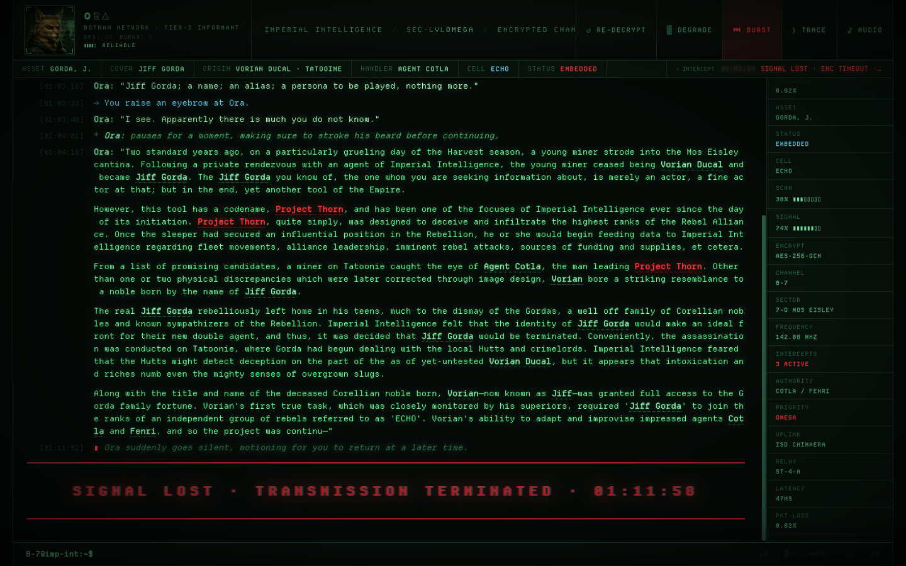
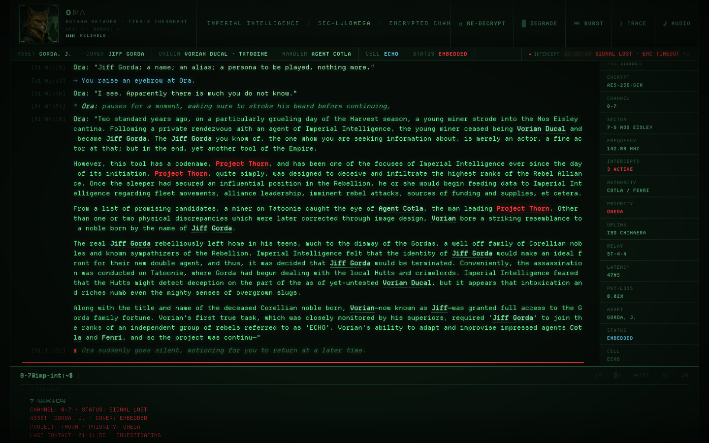
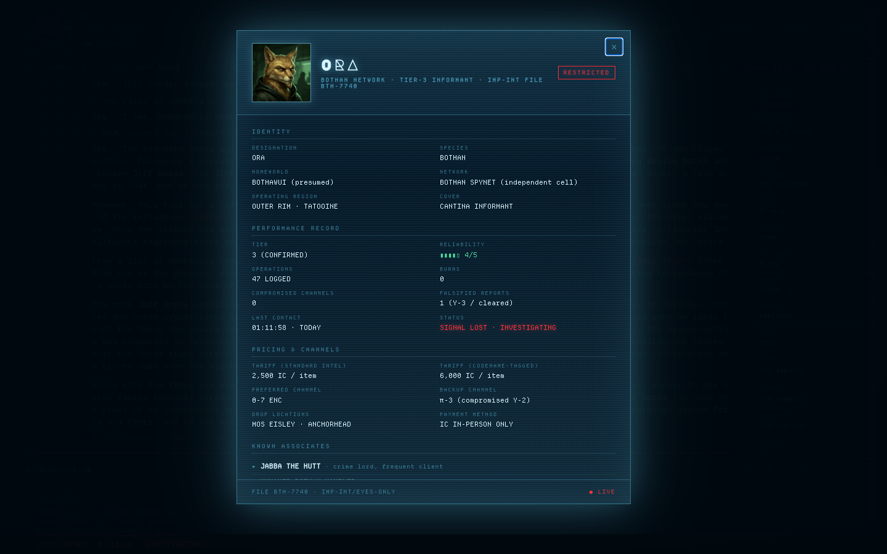

# PROJECT THORN

Imperial Intelligence terminal intercepting an encrypted transmission from a Bothan informant named Ora on Tatooine. Built from a 2003-era Star Wars Galaxies character bio (Vorian Ducal / Jiff Gorda)—animated with Aurebesh decryption, cue-scored audio, and a holographic dossier modal. Single HTML file, no build step.








## What this is

The original bio was written ~2003–2005 on the SWG forums as in-character roleplay. Chat-log structure: dialogue, emotes, system messages, narrative monologue, the player tipping 6,000 Imperial credits to a Bothan spy.

This page performs that text live—character by character, encrypted in Aurebesh glyphs, then decrypted into Latin script with a three-phase animation: fill → scramble → reveal.

## Open it

```bash
open index.html
```

No build, no server, no dependencies. ~83 KB index.html, 22 KB Departure Mono, 12 KB Aurebesh, 650 KB portrait, 20 KB seal, ~1.1 MB audio (3 tracks).

## Design

Bloomberg Terminal × Imperial CRT. Edge-to-edge data, single-pixel borders, monospace, amber phosphor with red for classified.

| Layer | Role |
|-------|------|
| Atmosphere | Vignette, ambient glow, screen flicker, CRT curvature |
| Chrome | Bothan **portrait** (painterly, CRT-filtered with flicker animation), role/ops counters, pulsing PROJECT THORN classification |
| Status strip | Asset metadata (cover, origin, handler, cell, status) plus the live **intercept stream** |
| Transcript | Aurebesh → Latin per-character decrypt, color-coded line types |
| Ticker | Imperial telemetry on the right edge: signal, encrypt, frequency, intercepts |
| Prompt | Cursor that never resolves (you can't reply to a Bothan) |
| Dossier modal | Holographic datapad overlay with scan lines, sweep animation, full asset profile—click the portrait |
| Audio | Three-track Web Audio engine with narrative-aware cue choreography |

### The intercept stream

The status strip logs what the Empire's surveillance system notices. Each event says something the dialogue doesn't:

- `BIO-SIG MATCH 99.7% · ORA VERIFIED`
- `CREDIT TX OBSERVED · 6,000 IC · ACK` (red)
- `CODENAME UTTERED · PROJECT THORN · MANDATORY LOG` (red)
- `COUNTERMEASURE DETECTED · UNKNOWN ORIGIN`—the moment Ora goes silent

Eighteen events, scheduled to absolute milliseconds and aligned with the decrypt timing. Severity drives color: info green, warn amber, alert red.

### Audio engine

Three audio tracks layered via Web Audio API:

| Track | File | Role |
|-------|------|------|
| Base | `sfx-base.mp3` (60s, loops) | Persistent transmission hum—always on, survives SIGNAL LOST |
| Accent A | `sfx-accent-a.mp3` (42s) | Data stream bursts—fired at narrative cue points |
| Accent B | `sfx-accent-b.mp3` (32s) | Telemetry pings—fired at surveillance events |

Accents are not random. A cue table (`AUDIO_CUES`) maps 19 scored moments to block indices and character-fraction thresholds:

- **Block 1** (boot): telemetry handshake, then data stream as channel establishes
- **Block 5** (credit transfer): data burst at 0.10 volume—loudest accent before the monologue
- **Block 7** (monologue): six cues tracking the narrative arc—"Vorian Ducal" named, "Project Thorn" uttered (double-hit, both accents), assassination revealed, pre-severance volume dip
- **Block 8** (interrupt): alarm burst at 0.12—peak volume—then `kill` command cuts all active sources

The base volume follows an arc from 0.08 (boot) → 0.15 (operational) → 0.19 (peak monologue) → 0.14 (pre-severance dip) → 0.05 (channel collapse) → 0.03 (signal lost, muffled through 200Hz lowpass sweep). The base never stops—it degrades.

Silence is scored: Block 3 (first words land clean), Block 7 fraction 0.40–0.55 (audience absorbs the mission objective after the "Project Thorn" double-hit).

### Aurebesh decrypt

Characters render in three phases:

1. **Fill**: Aurebesh glyphs appear via `@font-face` Aurebesh font at 10ms/char
2. **Scramble**: 3 frames of random Aurebesh substitution at 45ms/frame
3. **Decrypt**: Final Latin character revealed at 28ms/char

Block transitions pause for dramatic effect: 200ms–1400ms depending on narrative weight. Block 7 (the monologue) gets the longest inter-block pause at 1400ms.

## Line types

Seven types, each colored and prefixed:

| Type | Color | Prefix | Used for |
|------|-------|--------|----------|
| `system` | dim green | `>>>` | terminal status messages |
| `dialogue` | bright green | speaker tag | Ora's spoken lines |
| `emote` | dim green italic | `*` | Ora's actions |
| `action` | cyan | `→` | player actions |
| `credit` | red | `▮` | credit transfers |
| `narrative` | green | speaker tag | monologue paragraphs |
| `interrupt` / `signal-lost` | red | `▮` | transmission severed mid-sentence |

Inline tokens:

- `§Name§` → person tooltip (Vorian Ducal, Jiff Gorda, Cotla, Fenri)—underlines appear only after decryption
- `¤Project Thorn¤` → red classified marker with stamp on hover—underline hidden until decoded
- `¶` in narrative data-text → visible paragraph breaks in Block 7's monologue

## Interactive terminal

The command prompt at the bottom accepts in-universe commands with 25+ lore-aware responses.

| Command | Response |
|---------|----------|
| `ls` | File listing: intercept.log, thorn.enc, ora-profile.dat... |
| `whoami` | IMP-INT operator identity, clearance, handler |
| `ping ora` | Request timeout—host unreachable, signal lost |
| `ping chimera` | ISD Chimaera relay nominal |
| `scan` | Mos Eisley sector bio-signatures, Bothan matches |
| `status` | Channel state, asset cover, project priority |
| `cat intercept.log` | Points to transcript above |
| `cat thorn.enc` | Encrypted—clearance required |
| `history` | Session command log with intercept milestones |
| `sudo` / `rm` / `kill` | Denied with Imperial authority responses |
| `help` | List all available commands |

Unrecognized commands draw from 13 atmospheric error messages (read-only terminal, channel sealed, operator clearance revoked).

### Terminal audio

Valid commands trigger a 0.4s burst from `01-scifi-computer-terminal-unfa.mp3` at a random offset. Forbidden commands (`sudo`, `rm`, `kill`, `exit`, `decrypt`, `man`) and unrecognized input produce a square-wave double-beep (220Hz → 160Hz). Both respect the mute toggle.

### Dossier audio

Opening the holographic dossier plays an ascending sine sweep (400→1200→800Hz). Closing plays a descending sweep (800→300Hz).

## Controls

In-universe labels. No museum placards.

| Key | Button | Action |
|-----|--------|--------|
| `R` | ↺ RE-DECRYPT | Re-encrypt and replay the full intercept |
| `V` | ▒ DEGRADE | Chromatic aberration + heavy scanlines |
| `SPC` | ⏭ BURST | Burst-decode everything, jump to SIGNAL LOST |
| `L` | ⟫ TRACE | Signal-trace diagnostic log overlay |
| `M` | ♪ AUDIO | Mute/unmute (persists via localStorage) |

Portrait click opens the holographic dossier modal. Modifier keys pass through to the browser.

## Architecture

All transmission lines pre-rendered in HTML. JavaScript:

1. Walks `[data-text]` nodes, wraps characters in `<span class="char">` with Aurebesh initial content
2. Runs a `requestAnimationFrame` loop per block: fill frontier → decrypt frontier → scramble-reveal
3. Block completion triggers inter-block pause, then `beginBlock(next)`
4. Audio cue engine (`audioCueEngine`) evaluates `AUDIO_CUES` against block index and character-fraction progress on every animation tick

The animation is state-machine driven (`state.phase`: idle → running → done). No async chains in the hot path.

- `prefers-reduced-motion: reduce` skips all animation and disables audio
- BURST cancels in-flight timers, reveals all, fires SIGNAL LOST
- RE-DECRYPT resets state machine, re-encrypts characters to Aurebesh, replays from block 0
- Audio gate: `AudioContext` created lazily on first user gesture (autoplay policy). Only starts if `state.phase === 'running'`

## Assets

| File | Size | License |
|------|------|---------|
| `DepartureMono-Regular.woff2` | 22 KB | SIL OFL (Helena Zhang), see `DepartureMono-LICENSE.txt` |
| `Aurebesh.woff2` | 12 KB | Fan-made glyph font |
| `bothan-ora_image_0_0.jpg` | 650 KB | AI-generated portrait |
| `bothan-ora-seal.png` | 20 KB | AI-generated seal |
| `sfx-base.mp3` | 505 KB | Freesound (CC0/CC-BY) |
| `sfx-accent-a.mp3` | 307 KB | Freesound (CC0/CC-BY) |
| `sfx-accent-b.mp3` | 280 KB | Freesound (CC0/CC-BY) |
| `audio-candidates/01-scifi-computer-terminal-unfa.mp3` | 72 KB | Freesound (CC0), terminal command SFX |
| `imperial-favicon/` | ~10 KB | Imperial cog favicon (ICO + PNG) |

Major Mono Display loaded via Google Fonts (`<link>`) for the ORA name display.

## Built with

Designed and built using [claude-code-minoan](https://github.com/tdimino/claude-code-minoan) skills:

| Skill | Role |
|-------|------|
| `minoan-frontend-design` | Creative direction, design pipeline (`/shape` → audit → critique → polish) |
| `gemini-claude-resonance` | Bothan portrait generation via cross-model visual dialogue |
| `nano-banana-pro` | Dossier portrait with transmission/scanline effect |
| `design-critique` | Nielsen heuristic scoring, persona red flags, AI slop detection |
| `cloudflare` | Deployment to Cloudflare Pages via `wrangler` |
| `agent-browser` | DOM inspection, visual regression testing, pixel-level debugging |
| `codex-orchestrator` | Codex subagent review of JS/CSS implementation |

Subagents used during development: `kotharat` (design direction), `bohen` (JS/CSS verification), `scholiast` (Freesound research), `nomos` (architecture review), `sopher` (GitHub research).
