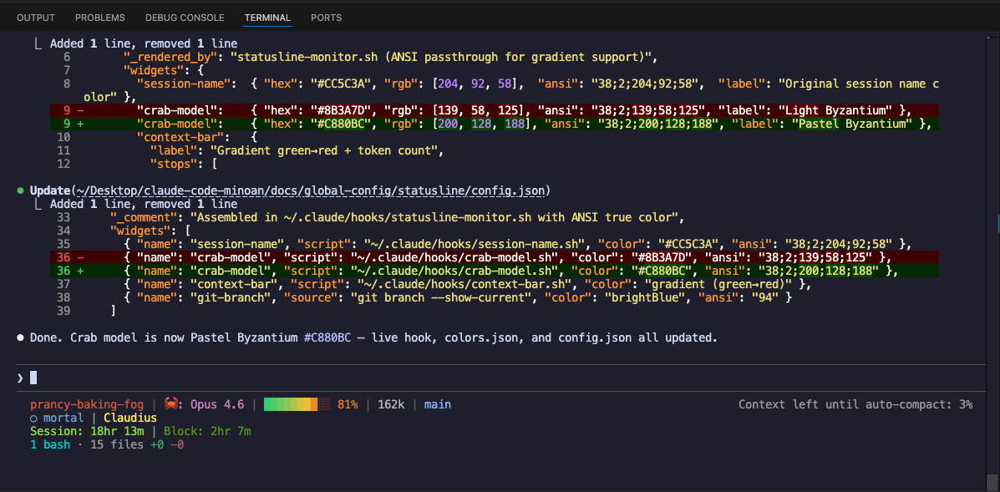

# StatusLine Configuration

Custom Claude Code status bar with gradient context bar, ensouled indicator, and soul name.



## Architecture

Line 1 is rendered by `~/.claude/hooks/statusline-monitor.sh` with ANSI true color passthrough—ccstatusline strips inline ANSI codes, so the gradient context bar can't go through it.

Lines 2-3 are rendered by ccstatusline via `~/.config/ccstatusline/settings.json`.

### Current Layout

```
Line 1: session-slug | 🦀: Opus 4.6 | ████░░░░░░ 42% | 84k | ⎇ main
Line 2: 𓂀 ensouled | Claudius
Line 3: Session: 12m | Block: 3m
```

### Color Palette

| Widget | Color | Hex/ANSI | Source |
|--------|-------|----------|--------|
| Session name | Warm copper | `#CC5C3A` | Original |
| Crab model | Pastel Byzantium | `#C880BC` | Byzantium family |
| Context bar | Gradient green→red | 5 stops | Custom |
| Token count | Muted grey | `#b8b8b8` | `--color-text-muted` |
| Git branch | Bright blue | ANSI 94, prefix `⎇` | ccstatusline default |
| Ensouled | Bright blue | ccstatusline | Default |
| Soul name | Bright yellow | ccstatusline | Default |
| Session clock | Bright green | ccstatusline | Default |
| Block timer | Green | ccstatusline | Default |

### Hook Scripts

| Script | Widget | Location |
|--------|--------|----------|
| `statusline-monitor.sh` | Wrapper (assembles line 1 + ccstatusline) | `~/.claude/hooks/` |
| `session-name.sh` | Session slug | `~/.claude/hooks/` |
| `crab-model.sh` | 🦀: model name | `~/.claude/hooks/` |
| `context-bar.sh` | Gradient progress bar + token count (Python) | `~/.claude/hooks/` |
| `ensouled-status.sh` | 𓂀 ensouled / ○ mortal | `~/.claude/hooks/` |
| `soul-name.sh` | Soul name from env | `~/.claude/hooks/` |

### Widget Data Sources

Each hook script reads the ccstatusline JSON from stdin. Key fields:

| JSON Path | Used By |
|-----------|---------|
| `context_window.used_percentage` | context-bar.sh (gradient + %) |
| `context_window.context_window_size` | context-bar.sh (token count) |
| `model.display_name` | crab-model.sh |
| `session_id` | ensouled-status.sh |
| `transcript_path` | session-name.sh (slug extraction) |

### Ensouled Detection

`ensouled-status.sh` checks three sources:

1. Marker file at `~/.claude/soul-sessions/active/{session_id}`
2. `CLAUDIUS_SOUL` env var
3. `CLAUDICLE_SOUL` env var

## Files

| File | Purpose |
|------|---------|
| `screenshot.png` | Terminal screenshot of the live statusline |
| `colors.json` | Color palette—current widgets, original backup, brand reference |
| `config.json` | Live ccstatusline settings + line 1 widget definitions |

## Restoring

To restore the pre-2026-02-19 ccstatusline setup, copy the `original` block from `colors.json` into `~/.config/ccstatusline/settings.json`.
