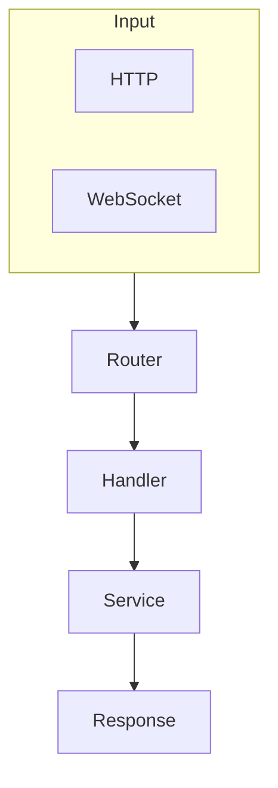

# Architecture.md Builder

The cartography skill. Teaches Claude how to create production-quality ARCHITECTURE.md files that serve as definitive maps of any codebase, following matklad's canonical guidelines with modern AI-agent documentation patterns.

**Last updated:** 2026-03-14

**Reflects:** matklad's [ARCHITECTURE.md guidelines](https://matklad.github.io/2021/02/06/ARCHITECTURE.md.html), rust-analyzer's architecture documentation, Divio documentation system principles, and multi-agent exploration patterns for large codebases.

---

## Why This Skill Exists

README.md tells users how to run the project. Code comments explain what a function does. Neither answers the question a new contributor actually has: *how does this whole thing fit together?*

ARCHITECTURE.md fills that gap. A single document that provides a bird's eye view, a coarse-grained codemap, named entities you can search for, and the invariants that hold the system together. matklad's insight was that this document should be country-level, not state-level---enough to orient, not enough to drown.

This skill encodes the full workflow: parallel exploration agents to map large codebases, the 9-section document structure (bird's eye view, data flow, codemap, invariants, cross-cutting concerns, layer boundaries, key files, FAQ), verification agents to catch inaccuracies, and quality guidelines for diagrams, line counts, and named entities. It also includes a starter template and detailed section-by-section guidance.

---

## Structure

```
architecture-md-builder/
  SKILL.md                              # Full workflow: research, explore, draft, verify
  README.md                             # This file
  assets/
    architecture-template.md            # Fill-in-the-blank starter template
  references/
    matklad-guidelines.md               # Canonical principles with rationale and examples
    document-structure.md               # Section-by-section guidance with length targets
```

---

## What It Covers

### matklad's 6 Principles

The foundation. Every ARCHITECTURE.md answers these concerns:

| Principle | What It Means | Example |
|-----------|--------------|---------|
| **Bird's eye overview** | Problem, approach, design principles | "On-demand computation via query-based architecture" |
| **Coarse-grained codemap** | Major directories and relationships | "The `crates/` directory contains 20+ crates organized by concern" |
| **Named entities** | Important files, types, modules by name | "`Database` trait in `base_db` defines the core query interface" |
| **Architectural invariants** | What is NEVER done, absence patterns | "We never block the main thread" |
| **Layer boundaries** | Transitions between systems | LSP Layer -> IDE Layer -> HIR Layer -> Syntax Layer |
| **Cross-cutting concerns** | Issues spanning multiple modules | Error handling, auth, logging, configuration |

Key discipline: names, not links. Symbol search (`Cmd+T`, `grep`) is more reliable than hyperlinks that rot.

### The 9-Section Document

Every ARCHITECTURE.md produced by this skill follows this structure:

```
ARCHITECTURE.md
├── Introduction              # 2-4 sentences: what this doc is, who it's for
├── Bird's Eye View           # Problem, paradigm, principles, ASCII diagram
├── High-Level Data Flow      # Mermaid flowchart, 10-20 nodes max
├── Codemap                   # Per-subsystem: tree, key abstractions table, patterns
│   ├── System 1 (`path/`)
│   ├── System 2 (`path/`)
│   └── ...
├── Architectural Invariants  # Rules that are always true, with code examples
├── Cross-Cutting Concerns    # Aspect tables: where, pattern, config
├── Layer Boundaries          # ASCII diagram with interface descriptions
├── Key Files Reference       # Top 10-30 files with line counts and purpose
└── Common Questions          # FAQ: "Where do I add a new X?"
```

See `references/document-structure.md` for line-by-line guidance on each section.

### Multi-Agent Exploration Workflow

Large codebases can't be mapped by reading a few files. The skill uses parallel exploration agents to cover ground efficiently:

| Phase | What Happens | Agents |
|-------|-------------|--------|
| **1. Research** | Search for exemplary ARCHITECTURE.md files via Exa | Optional |
| **2. Explore** | Launch 2-4 agents targeting major subsystems (core, transport, frontend, storage) | 2-4 |
| **3. Draft** | Synthesize agent findings into the 9-section structure | 1 (you) |
| **4. Verify** | Launch 2-3 agents to check accuracy, line counts, file existence | 2-3 |
| **5. Correct** | Apply fixes from verification | 1 (you) |

Each exploration agent targets a system area and asks: What are the key abstractions? How does data flow? What are the main files and their sizes? What patterns are enforced? Target ~10-15k words of analysis per agent.

### Diagrams

Two diagram types, each with a purpose:

**ASCII diagrams** for component relationships and layer boundaries:
```
┌─────────────┐     ┌─────────────┐     ┌─────────────┐
│  Frontend   │────>│   Backend   │────>│  Database   │
└─────────────┘     └─────────────┘     └─────────────┘
```

**Mermaid diagrams** for data flows:


Guidelines: use subgraphs to group related components, label edges when the transformation matters, keep to 10-20 nodes maximum.

### Line Counts

Include approximate line counts for key files. They help readers gauge complexity at a glance:

- Use `wc -l` to verify
- Round to nearest 10 or 50
- Format: `file.ts (~500 lines)`

### Target Document Length

| Project Size | LOC | Target Length |
|-------------|-----|---------------|
| Small | <10k | 200-400 lines |
| Medium | 10-50k | 400-700 lines |
| Large | 50-200k | 700-1,000 lines |
| Very large | >200k | 800-1,200 lines (split if needed) |

### Verification Checklist

After drafting, verify before committing:

- [ ] All referenced files exist
- [ ] Line count estimates within 20% of actual
- [ ] ASCII/Mermaid diagrams render correctly
- [ ] Document answers "where's the thing that does X?"
- [ ] No stale information from previous versions
- [ ] Named entities can be found via symbol search

---

## What NOT to Include

ARCHITECTURE.md is a map, not an encyclopedia:

| Exclude | Why | Where It Belongs |
|---------|-----|-----------------|
| API documentation | Changes too frequently | JSDoc/rustdoc/docstrings |
| User guides | Different audience | README.md or `docs/` |
| Implementation details | Too granular | Code comments |
| Historical decisions | Not actionable for navigation | ADRs or commit messages |
| Bug fixes, new features | Don't change architecture | No update needed |

---

## Maintenance

Update the document when:
- Major new subsystem added
- Architectural pattern changed
- Key file renamed or moved
- Quarterly review (scheduled)

Do NOT update for bug fixes, new features within existing patterns, or refactoring that doesn't change architecture. The document should be stable enough to survive months without edits.

---

## Template

`assets/architecture-template.md` provides a fill-in-the-blank starting point with placeholder sections for every part of the 9-section structure. Copy it to your project root and replace `[PLACEHOLDERS]`:

```bash
cp ~/.claude/skills/architecture-md-builder/assets/architecture-template.md ./ARCHITECTURE.md
```

---

## Requirements

- No scripts or external dependencies
- Exa search recommended for Phase 1 research (but not required)
- `wc -l` for line count verification

---

## Part of Claude-Code-Minoan

This skill is part of [claude-code-minoan](https://github.com/tdimino/claude-code-minoan)---curated Claude Code configuration including skills, MCP servers, slash commands, and CLI tools.

Install:

```bash
cp -r skills/core-development/architecture-md-builder ~/.claude/skills/
```
