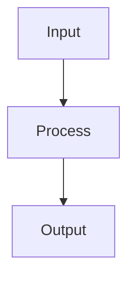

# Architecture.md Builder

Create production-quality ARCHITECTURE.md files that serve as definitive maps of any codebase, following matklad's canonical guidelines with modern AI-agent documentation patterns.

## When to Use This Skill

- Creating architecture documentation for a new or existing repository
- Auditing a codebase to understand its structure
- Onboarding documentation for developers and AI agents
- User asks to "document the architecture", "create architecture.md", or "map this codebase"

## Core Principles (matklad's Guidelines)

The canonical ARCHITECTURE.md follows these principles:

1. **Bird's eye overview** - Problem being solved, high-level approach
2. **Coarse-grained codemap** - Modules and relationships (country-level, not state-level)
3. **Named entities** - Important files, types, modules by name (no links, use symbol search)
4. **Architectural invariants** - Constraints, what is NOT done, absence patterns
5. **Layer boundaries** - Transitions between systems
6. **Cross-cutting concerns** - Issues spanning multiple modules

See `references/matklad-guidelines.md` for detailed explanations.

## Workflow

### Phase 1: Research Best Practices (Optional)

If unfamiliar with architecture documentation patterns, use Exa search:

```bash
# Search for exceptional architecture.md examples
python3 ~/.claude/skills/exa-search/scripts/exa_search.py \
  "architecture.md documentation best practices" \
  --category github -n 10

# Find matklad's original guidelines
python3 ~/.claude/skills/exa-search/scripts/exa_research.py \
  "matklad ARCHITECTURE.md guidelines rust-analyzer"
```

### Phase 2: Codebase Exploration

Launch 2-4 parallel exploration agents to map the codebase thoroughly:

```
Use the Task tool with subagent_type=Explore for each major system area:

1. Core/Engine - Entry points, main abstractions, data structures
2. Transport/API - HTTP, WebSocket, message handling
3. Database/Persistence - Schema, migrations, queries
4. Frontend/UI - Components, state management, routing
```

**Agent prompts should ask:**
- What are the key abstractions and types?
- How does data flow through this system?
- What are the main files and their line counts?
- What patterns are used consistently?
- What invariants does the code enforce?

**Target output:** ~10-15k words of analysis per agent covering the full system.

### Phase 3: Draft ARCHITECTURE.md

Create the document following this structure:

```markdown
# Architecture

Brief intro: what this document is for, who it's for.

## Bird's Eye View

- What problem does this solve?
- What is the core paradigm/approach?
- Key design principles (3-5 bullets)

[ASCII diagram showing major components]

## High-Level Data Flow

[Mermaid flowchart showing data flow]

## Codemap

### System 1 (`path/`)
Description, key files with line counts, key abstractions table.

### System 2 (`path/`)
...

## Architectural Invariants

Rules that are ALWAYS true. Code patterns that are NEVER violated.

## Cross-Cutting Concerns

Issues that span multiple modules (auth, logging, error handling).

## Layer Boundaries

Diagram showing layers and their interfaces.

## Key Files Reference

| File | Lines | Purpose |
|------|-------|---------|
| ... | ... | ... |

## Common Questions

FAQ format: "Where do I find X?" → Answer
```

See `references/document-structure.md` for detailed section guidance.
See `assets/architecture-template.md` for a starting template.

### Phase 4: Verification

Launch 2-3 review agents to verify accuracy:

```
Use the Task tool with subagent_type=Explore to verify:

1. General accuracy - Do descriptions match actual code?
2. Line counts - Are they roughly accurate?
3. File references - Do all referenced files exist?
```

**Verification checklist:**
- [ ] All referenced files exist
- [ ] Line count estimates within 20% of actual
- [ ] ASCII/Mermaid diagrams render correctly
- [ ] Document answers "where's the thing that does X?"
- [ ] No stale information from previous versions

### Phase 5: Apply Corrections

Update the document based on review findings:
- Correct line counts
- Add missing files to structures
- Fix any inaccurate descriptions
- Update counts (e.g., "11 modules" → "13 modules")

## Quality Guidelines

### Diagrams

**ASCII diagrams** for component relationships:
```
┌─────────────┐     ┌─────────────┐
│  Frontend   │────▶│   Backend   │
└─────────────┘     └─────────────┘
```

**Mermaid diagrams** for data flows:


### Line Counts

Include approximate line counts for key files:
- Helps readers gauge complexity
- Use `wc -l` to verify
- Round to nearest 10 or 50

### Named Entities

Reference files, types, and modules by name without links:
- Good: "See `WorkingMemory.ts` for the immutable memory implementation"
- Bad: "See [WorkingMemory](./src/lib/core/WorkingMemory.ts)"

Why: Symbol search (Cmd+T, osgrep) is more reliable than links that rot.

### Invariants

Document what the code NEVER does:
- "WorkingMemory never mutates in place"
- "API keys never reach the browser"
- "All database queries use prepared statements"

### Target Length

- Small projects: 200-400 lines
- Medium projects: 400-700 lines
- Large projects: 700-1000 lines
- Maximum: ~1200 lines (split into linked docs if larger)

## Output

Single file: `ARCHITECTURE.md` in project root

Optionally update `CLAUDE.md` or `README.md` with a reference to the new architecture document.

## Example Usage

```
User: "Create an architecture.md for this repo"

1. Launch 3 exploration agents targeting core, transport, and frontend
2. Synthesize findings into ARCHITECTURE.md following the template
3. Launch 2 review agents to verify accuracy
4. Apply corrections
5. Commit and optionally update CLAUDE.md
```

## Resources

- `references/matklad-guidelines.md` - Canonical guidelines with rationale
- `references/document-structure.md` - Detailed section guidance
- `assets/architecture-template.md` - Starting template
