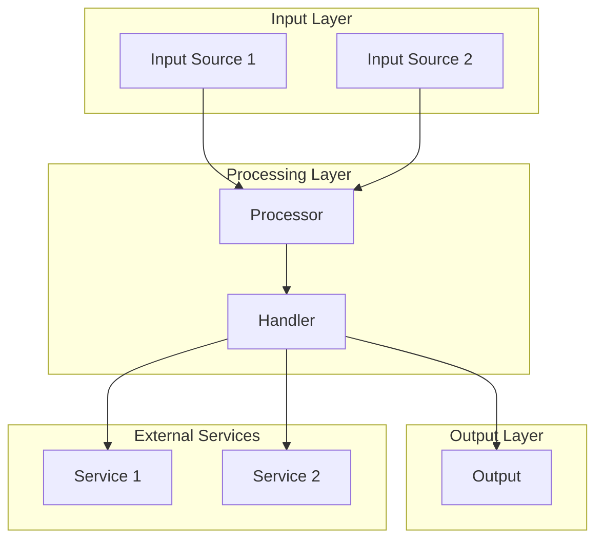

# Architecture

This document describes the high-level architecture of [PROJECT_NAME].
If you want to familiarize yourself with the codebase, you are in the right place.

For detailed component documentation, see `[DOCS_PATH]`. This document provides the bird's eye view and codemap to help you navigate.

## Bird's Eye View

[PROJECT_NAME] is a **[BRIEF_DESCRIPTION]** that [WHAT_IT_DOES].

The core design principles are:
- **[PRINCIPLE_1]**: [Brief explanation]
- **[PRINCIPLE_2]**: [Brief explanation]
- **[PRINCIPLE_3]**: [Brief explanation]

```
┌─────────────────────────────────────────────────────────────────────────────┐
│                              [PROJECT_NAME]                                  │
├─────────────────────────────────────────────────────────────────────────────┤
│                                                                             │
│   ┌─────────────┐     ┌─────────────────┐     ┌──────────────────────┐     │
│   │   [LAYER1]  │────▶│    [LAYER2]     │────▶│      [LAYER3]        │     │
│   │             │◀────│                 │◀────│                      │     │
│   └─────────────┘     └─────────────────┘     └──────────────────────┘     │
│         │                     │                         │                   │
│         │                     │                         ▼                   │
│         │              ┌──────┴──────┐         ┌──────────────────┐        │
│         │              │ [COMPONENT] │         │   [COMPONENT]    │        │
│         │              └─────────────┘         └──────────────────┘        │
│         │                                              │                   │
│         ▼                                              ▼                   │
│   ┌─────────────┐                            ┌──────────────────┐         │
│   │ [COMPONENT] │                            │    [STORAGE]     │         │
│   └─────────────┘                            └──────────────────┘         │
│                                                                             │
└─────────────────────────────────────────────────────────────────────────────┘
```

## High-Level Data Flow



---

## Codemap

### [System 1] (`[path/]`)

[Description of what this system does].

```
[path]/
├── [subdir1]/           # [Purpose]
│   ├── [file1].ts       # [Description] (~XXX lines)
│   └── [file2].ts       # [Description] (~XXX lines)
│
├── [subdir2]/           # [Purpose]
│   └── [file3].ts       # [Description] (~XXX lines)
│
└── [file4].ts           # [Description] (~XXX lines)
```

**Key Abstractions:**

| Type | File | Purpose |
|------|------|---------|
| `[TypeName]` | `[file].ts` | [One-line description] |
| `[TypeName]` | `[file].ts` | [One-line description] |

---

### [System 2] (`[path/]`)

[Description of what this system does].

```
[path]/
├── [file1].ts           # [Description] (~XXX lines)
├── [file2].ts           # [Description] (~XXX lines)
└── [subdir]/
    └── [file3].ts       # [Description] (~XXX lines)
```

**Key Abstractions:**

| Type | File | Purpose |
|------|------|---------|
| `[TypeName]` | `[file].ts` | [One-line description] |

---

### [System 3] (`[path/]`)

[Continue pattern for each major system...]

---

## Architectural Invariants

These constraints are fundamental to the system design:

### [Category 1]
```typescript
// CORRECT: [How to do it right]
[correctExample];

// WRONG: [What never happens]
// [wrongExample]; // ❌ FORBIDDEN
```

### [Category 2]
```
[Rule description]:
• [Specific rule 1]
• [Specific rule 2]
• [Specific rule 3]
```

### [Category 3]
```typescript
// [Description of pattern]
[codeExample];
```

---

## Cross-Cutting Concerns

### [Concern 1]

[How this concern is handled].

| Aspect | Implementation |
|--------|----------------|
| [Aspect 1] | [Description] |
| [Aspect 2] | [Description] |

### [Concern 2]

[How this concern is handled].

### [Concern 3]

[How this concern is handled].

---

## Layer Boundaries

Understanding these boundaries helps navigate the codebase:

```
┌─────────────────────────────────────────────────────────────────────────┐
│ [LAYER 1] ([Description])                                               │
│ • [Component A]                                                         │
│ • [Component B]                                                         │
├─────────────────────────────────────────────────────────────────────────┤
│ ▲ [Interface description]                                              │
│ ▼ [What crosses this boundary]                                         │
├─────────────────────────────────────────────────────────────────────────┤
│ [LAYER 2] ([Description])                                               │
│ • [Component C]                                                         │
│ • [Component D]                                                         │
├─────────────────────────────────────────────────────────────────────────┤
│ ▲ [Interface description]                                              │
│ ▼ [What crosses this boundary]                                         │
├─────────────────────────────────────────────────────────────────────────┤
│ [LAYER 3] ([Description])                                               │
│ • [Component E]                                                         │
│ • [Component F]                                                         │
└─────────────────────────────────────────────────────────────────────────┘
```

---

## Key Files Reference

Quick reference for the most important files by system:

### [System 1]
| File | Lines | Purpose |
|------|-------|---------|
| `[path/file1].ts` | ~XXX | [Brief description] |
| `[path/file2].ts` | ~XXX | [Brief description] |

### [System 2]
| File | Lines | Purpose |
|------|-------|---------|
| `[path/file3].ts` | ~XXX | [Brief description] |
| `[path/file4].ts` | ~XXX | [Brief description] |

---

## Common Questions

**"Where do I add a new [X]?"**
→ `[path/to/directory/]` using `[Pattern]` from `[file].ts`

**"Where is [Y] handling?"**
→ `[path/file].ts` routes to `[function]()` in `[other_file].ts`

**"How do I [Z]?"**
→ [Brief explanation with file references]

**"Where is [W] configured?"**
→ `[path/config].ts` for [context], `[other]` for [other context]

---

## Further Reading

Detailed documentation in `[DOCS_PATH]/`:

| Topic | File |
|-------|------|
| [Topic 1] | `[docs/topic1].md` |
| [Topic 2] | `[docs/topic2].md` |
| [Topic 3] | `[docs/topic3].md` |
