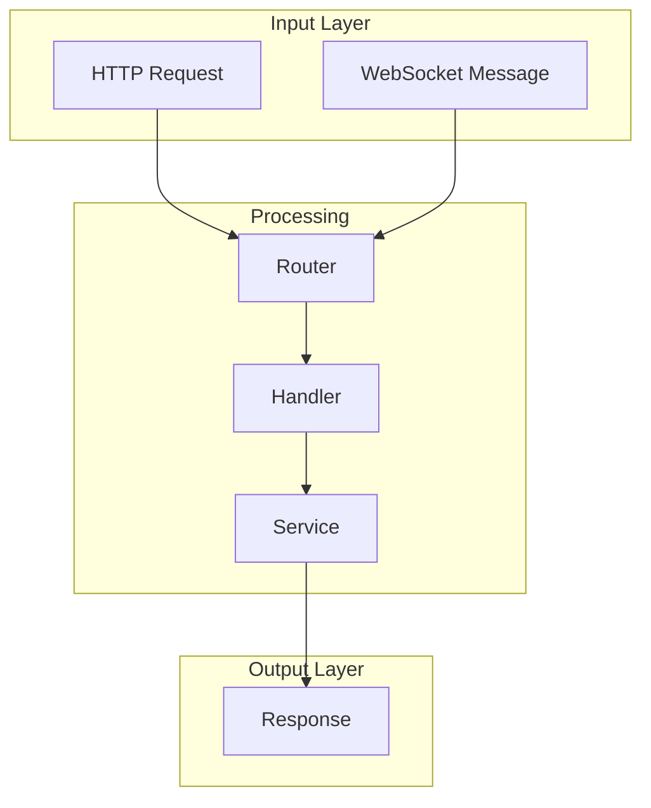

# ARCHITECTURE.md Document Structure

Detailed guidance for each section of the architecture document.

## Section 1: Introduction

**Purpose:** Orient the reader immediately.

```markdown
# Architecture

This document describes the high-level architecture of [Project Name].
If you want to familiarize yourself with the codebase, you are in the right place.

For detailed component documentation, see `[path]`. This document provides
the bird's eye view and codemap to help you navigate.
```

**Length:** 2-4 sentences

## Section 2: Bird's Eye View

**Purpose:** Explain what the project does and how it approaches the problem.

**Include:**
- Problem domain (1-2 sentences)
- Core paradigm or approach
- Key design principles (3-5 bullet points)
- High-level ASCII diagram

**ASCII Diagram Pattern:**
```
┌─────────────────────────────────────────────────────────────────┐
│                         PROJECT NAME                             │
├─────────────────────────────────────────────────────────────────┤
│                                                                   │
│   ┌───────────┐     ┌───────────────┐     ┌──────────────┐      │
│   │  Input    │────▶│   Processing  │────▶│   Output     │      │
│   │  Layer    │◀────│   Layer       │◀────│   Layer      │      │
│   └───────────┘     └───────────────┘     └──────────────┘      │
│         │                   │                    │                │
│         └───────────────────┼────────────────────┘                │
│                             ▼                                     │
│                    ┌──────────────┐                               │
│                    │   Storage    │                               │
│                    └──────────────┘                               │
│                                                                   │
└─────────────────────────────────────────────────────────────────┘
```

**Length:** 30-60 lines including diagram

## Section 3: High-Level Data Flow

**Purpose:** Show how data moves through the system.

**Use Mermaid for complex flows:**


**Tips:**
- Use subgraphs to group related components
- Label edges when the transformation matters
- Keep to 10-20 nodes maximum

**Length:** 20-40 lines

## Section 4: Codemap

**Purpose:** Provide a navigable map of the source code.

**Structure each subsystem as:**

```markdown
### Subsystem Name (`path/to/directory/`)

Brief description of what this subsystem does and its responsibilities.

[Directory tree or file listing]

**Key Abstractions:**

| Type | File | Purpose |
|------|------|---------|
| `ClassName` | `file.ts` | One-line description |
| `InterfaceName` | `types.ts` | One-line description |

**Patterns Used:**
- Pattern 1: Brief explanation
- Pattern 2: Brief explanation
```

**Tips:**
- Include line counts for major files: `file.ts (~500 lines)`
- Group by responsibility, not alphabetically
- Mention the "main" file first

**Length:** 50-100 lines per major subsystem

## Section 5: Architectural Invariants

**Purpose:** Document rules that are always true.

**Format:**
```markdown
## Architectural Invariants

These constraints are fundamental to the system design:

### Invariant Category

```typescript
// CORRECT: How to do it right
const example = correctPattern();

// WRONG: What never happens
// badPattern(); // ❌ FORBIDDEN
```

### Another Category

- Rule 1
- Rule 2
- Rule 3
```

**Common invariant categories:**
- Memory/state management
- Security boundaries
- Threading/concurrency
- Data validation
- Error handling

**Length:** 30-60 lines

## Section 6: Cross-Cutting Concerns

**Purpose:** Address issues spanning multiple modules.

**Common concerns:**
- Session/auth management
- Error handling strategy
- Logging and observability
- Configuration
- Rate limiting
- Caching

**Format:**
```markdown
## Cross-Cutting Concerns

### Concern Name

How this concern is handled, with brief examples or references.

| Aspect | Implementation |
|--------|----------------|
| Where | `path/to/files` |
| Pattern | Description |
| Config | How to configure |
```

**Length:** 40-80 lines

## Section 7: Layer Boundaries

**Purpose:** Show how components interface with each other.

**ASCII Diagram Pattern:**
```
┌─────────────────────────────────────────────────────┐
│ LAYER 1 (External)                                  │
│ • Component A                                       │
│ • Component B                                       │
├─────────────────────────────────────────────────────┤
│ ▲ Interface/Protocol description                   │
│ ▼ What crosses this boundary                       │
├─────────────────────────────────────────────────────┤
│ LAYER 2 (Internal)                                  │
│ • Component C                                       │
│ • Component D                                       │
├─────────────────────────────────────────────────────┤
│ ▲ Interface/Protocol description                   │
│ ▼ What crosses this boundary                       │
├─────────────────────────────────────────────────────┤
│ LAYER 3 (Storage)                                   │
│ • Database                                          │
│ • Cache                                             │
└─────────────────────────────────────────────────────┘
```

**Length:** 30-50 lines

## Section 8: Key Files Reference

**Purpose:** Quick reference for the most important files.

**Format:**
```markdown
## Key Files Reference

### Category Name
| File | Lines | Purpose |
|------|-------|---------|
| `path/to/file.ts` | ~500 | Brief description |
| `path/to/other.ts` | ~300 | Brief description |
```

**Tips:**
- Group by subsystem or concern
- Include only truly important files (10-30 total)
- Keep descriptions to 5-10 words

**Length:** 30-60 lines

## Section 9: Common Questions (Optional)

**Purpose:** FAQ for common navigation questions.

**Format:**
```markdown
## Common Questions

**"Where do I add a new X?"**
→ `path/to/directory/` using the `Pattern` from `file.ts`

**"How does Y work?"**
→ See `MainFile.ts` which calls `OtherFile.ts`

**"Where is Z configured?"**
→ `config/file.ts` for development, environment variables for production
```

**Length:** 20-40 lines

## Total Document Length

| Project Size | Target Length |
|--------------|---------------|
| Small (<10k LOC) | 200-400 lines |
| Medium (10-50k LOC) | 400-700 lines |
| Large (50-200k LOC) | 700-1000 lines |
| Very Large (>200k LOC) | 800-1200 lines (split if needed) |

## Maintenance Triggers

Update the document when:
- Major new subsystem added
- Architectural pattern changed
- Key file renamed or moved
- Quarterly review (scheduled)

Do NOT update for:
- Bug fixes
- New features within existing patterns
- Refactoring that doesn't change architecture
