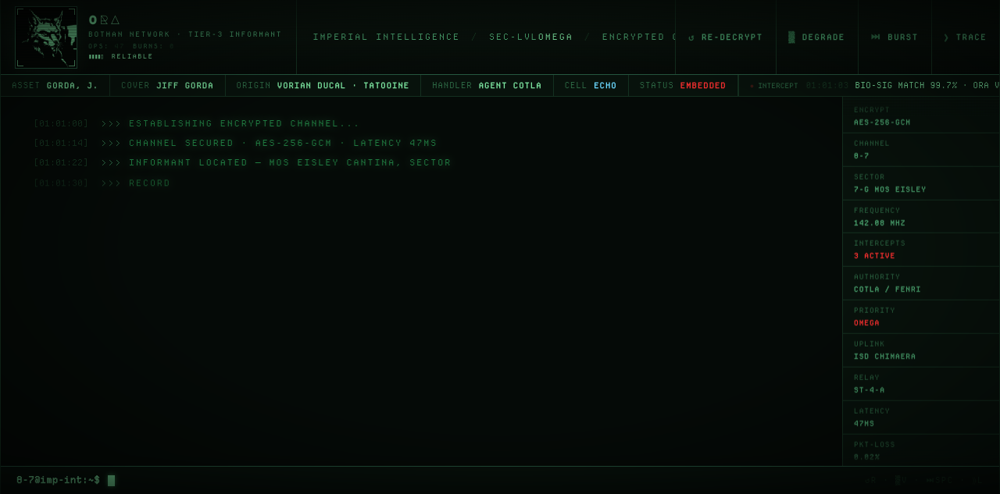
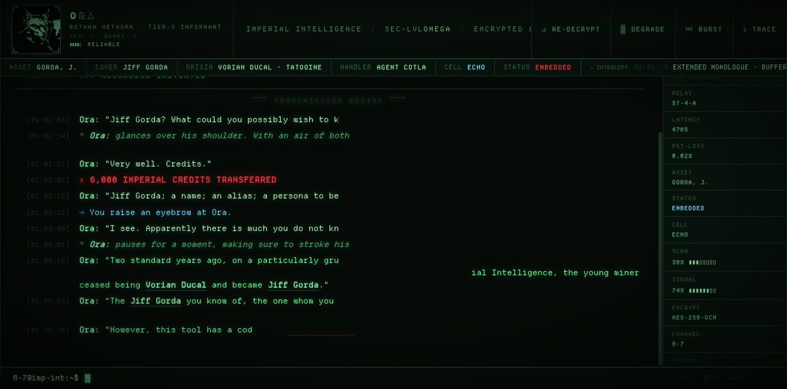

# Demo · Project Thorn

A reference implementation of the **Bloomberg Terminal × Imperial CRT** archetype from `creative-arsenal.md`. Renders a 2003-era Star Wars Galaxies character bio as a live encrypted-channel transmission from a Bothan informant.



## Why this demo exists

Most "terminal aesthetic" pages produced by AI fall into the generic-hacker-Matrix tell: pure `#00FF00` monospace on `#000`, default fonts, scanlines as decoration. This demo shows what the same archetype looks like committed properly:

- **Desaturated phosphor green** (`#7ce5a0`, not `#00FF00`) reads as Imperial datapad, not Matrix terminal
- **Avatar processed into a two-tone seal** rather than dropped in as a clean profile picture
- **Bloomberg-density status strip** with named asset metadata (cover, origin, handler, cell, status) instead of empty hero space
- **Live intercept stream** narrating the conversation as data — what the Empire's surveillance system notices that the dialogue itself never says
- **Per-character CSS typewriter** — pre-rendered HTML, JS only assigns `--d` animation-delay custom properties; no async render loop
- **Color-coded line types teach themselves** through the content (system / dialogue / emote / action / credit / narrative / interrupt)
- **Dramatic SIGNAL LOST** with chromatic-aberration text-shadow, screen flash, and glitch on the prior line

## What to extract

| Pattern | Where in code | Useful for |
|---------|---------------|------------|
| Per-character CSS typewriter (no JS animation loop) | `buildAnimation()` + `.char { animation-delay: var(--d) }` | Any progressive text reveal |
| `pre-reveal` `display: none` + `setTimeout` reveal | `.line.pre-reveal` plus the schedule loop | Sequential staggered reveals where layout shouldn't pre-allocate space |
| Two-tone seal portrait | `magick input.jpg -threshold 45% +level-colors '#050a07','#7ce5a0'` | Treating any image as "low-bandwidth feed" rather than a profile photo |
| 9-layer box-shadow on chrome | `.chrome` rule | Floating-card depth on dark backgrounds |
| Pulsing classified marker | `.chrome__title .classified` | Drawing eye to one specific phrase without overusing red |
| Inline tooltips via `:hover::after` (no JS popover) | `.person:hover::after`, `.thorn:hover::after` | Lightweight contextual definitions |
| `sessionStorage` round-trip for state-preserving reload | `replay()` function | "Restart but keep my preferences" pattern |
| Reduced-motion handled inside `buildAnimation` | top of the function | Required when using `display: none` for staged reveals |
| Live event stream commenting on user activity | `INTERCEPT_LOG` + `scheduleInterceptLog()` | Diegetic UI that reads as a separate observing system |

## Files

| File | Purpose |
|------|---------|
| `index.html` | The full self-contained artifact (~52 KB, no build step) |
| `bothan-ora-seal.png` | Two-tone phosphor seal (22 KB) |
| `bothan-ora_image_0_0.jpg` | Original painterly reference, kept for the threshold pipeline |
| `DepartureMono-Regular.woff2` | Helena Zhang's Departure Mono — period-correct CRT mono, SIL OFL |
| `DepartureMono-LICENSE.txt` | OFL license for the font |
| `preview-01-boot.png` | Stage 1 (~3s): system messages typing in |
| `preview-02-dialogue.png` | Stage 2 (~14s): first dialogue, emote, credit transfer |
| `preview-03-narrative.png` | Stage 3 (~32s): narrative paragraphs with character tooltips and `Project Thorn` red marker |



## How to view

```bash
open index.html
```

Single file. No build, no server, no dependencies. Departure Mono is bundled as woff2; Major Mono Display loads from Google Fonts via `<link>` for the ORA name.

## Controls

In-universe labels. No museum placards on the relic.

| Key | Button | Action |
|-----|--------|--------|
| `R` | ↺ RE-DECRYPT | Restart the transmission from initial intercept |
| `V` | ▒ DEGRADE | Apply analog feed degradation |
| `SPC` | ⏭ BURST | Burst-decode the entire intercept |
| `L` | ⟫ TRACE | Show signal-trace diagnostics |

## Lessons from four review iterations

1. **Don't drive sequential text reveals from a JS async chain.** An earlier implementation used `await sleep(N)` chains and broke silently when CSS filters interacted with grid layouts. CSS-driven typewriter via per-character `animation-delay` is the right architecture; JS only schedules `display` toggles.

2. **Process generated images through the design's physical constraints.** A clean painterly portrait dropped into a CRT terminal reads as a Discord avatar. Threshold + color-remap to two-tone phosphor and it becomes part of the diegesis.

3. **`display: none` lines + per-line `setTimeout` reveal beats `opacity: 0` + autoscroll.** With opacity-only hiding and a fixed transcript height, autoscroll-to-bottom jumps to where the future last line will appear, leaving the user staring at empty space while the first line types in above the fold. With `display: none`, the transcript only contains revealed content and autoscroll naturally tracks.

4. **Track `setTimeout` handles even when `replay()` reloads.** BURST needs to cancel in-flight reveal timers to prevent SIGNAL LOST firing twice.

5. **Desaturate the phosphor.** `#5cff90` reads as Matrix. `#7ce5a0` reads as Imperial. The difference is ~10 chroma points in OKLCH space and it changes the genre.

6. **Diegetic controls beat literal controls.** REPLAY / VHS / SKIP / LOG read as museum placards on the relic. RE-DECRYPT / DEGRADE / BURST / TRACE belong to the fiction. Same JS handlers, different semantic frame.

## Reference docs used

- `references/creative-arsenal.md` — Bloomberg Terminal archetype
- `references/text-animation-catalog.md` — typewriter spec (240ms / 46ms steps)
- `references/anti-patterns.md` — color overload check, second-reflex font tells
- `references/heuristics-scoring.md` — design critique scoring
- `references/personas.md` — persona red flag review
