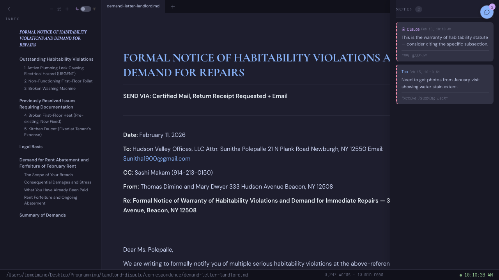

# mdpreview

Catppuccin-themed live-reloading Markdown viewer with multi-tab support, annotations, bookmarks, and resizable TOC. Extends the idea behind [`mdserve`](https://github.com/jfernandez/mdserve) with a full editorial UI.

> **Canonical source**: [github.com/tdimino/md-preview-and-annotate](https://github.com/tdimino/md-preview-and-annotate)



## Install

Copy or symlink the skill into `~/.claude/skills/`:

```bash
ln -s "$(pwd)" ~/.claude/skills/mdpreview
```

## Usage

```bash
# Preview files
python3 -m md_preview_and_annotate file.md [file2.md ...] --port 3031

# Tab reuse — if server is already running, new files open as tabs automatically
python3 -m md_preview_and_annotate another.md

# Explicit add to running server (legacy)
python3 -m md_preview_and_annotate --add another.md --port 3031

# Add annotation from CLI
python3 -m md_preview_and_annotate --annotate file.md \
  --text "RPL §235-b" --author "Claude" --comment "Cite the specific subsection"
```

## Features

- **Live reload** — 500ms polling, refreshes on save
- **Multi-tab** — open, switch, add/close tabs at runtime
- **Tab reuse** — launching a new file while the server is running adds it as a tab instead of restarting
- **5 annotation types** — Comment, Question, Suggestion, Important, Bookmark
- **Threaded replies** — reply to any annotation inline
- **Resolve/archive workflow** — resolved annotations move to a separate archive file
- **Global bookmark index** — bookmarks persist to `~/.claude/bookmarks/` with `INDEX.md` and per-snippet files
- **Auto-cleanup of orphaned annotations** — when anchor text is deleted, annotations are removed on next load
- **Sidecar JSON** — `file.md.annotations.json` persistence (original markdown never modified)
- **Catppuccin** — Mocha (dark) / Latte (light) with 26 CSS vars
- **Typography** — Cormorant Garamond · DM Sans · Victor Mono
- **Resizable TOC sidebar** — drag the right edge to adjust width (persisted in localStorage)
- **Cross-file links** — clicking a `.md` link opens the target as a new tab
- **Chrome --app** — frameless native-feel window
